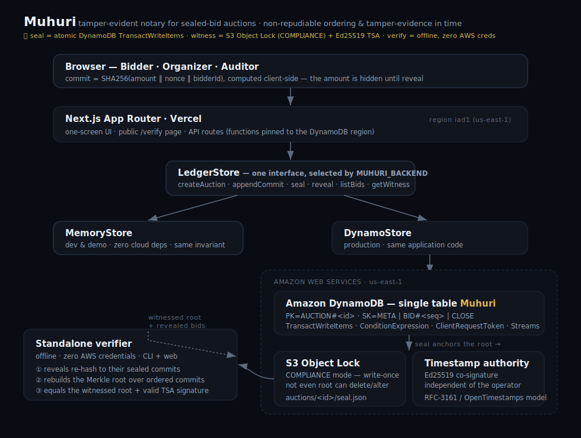

# Muhuri

**A tamper-evident notary for sealed-bid auctions and RFP procurement.**

Muhuri proves that a set of bids happened **in a specific order, before a deadline** — with no
backdating, reordering, or post-hoc tampering — and lets an **outsider verify it independently, without
trusting the operator.** (*Muhuri* is Swahili for *seal / stamp*.)

> **The guarantee — non-repudiable ordering and tamper-evidence in time.**
> No bid can be inserted, altered, reordered, or backdated after an auction seals — and the seal itself
> was witnessed externally *before any bid could be forged*, so even the operator cannot have rigged it.

## Why a hash chain alone isn't enough

An append-only hash chain that the operator controls proves nothing to an outsider: the operator could
discard it and rebuild a fraudulent chain before anyone looks. Non-repudiation requires that the
fingerprint of the sealed set be **observed by a party the operator cannot influence, at seal time.**

Muhuri anchors every seal to an external **witness quorum**:

1. **Amazon S3 Object Lock (COMPLIANCE mode)** — a write-once object that *no one*, not even the account
   root, can overwrite or delete until retention expires.
2. **An independent timestamp authority** — an Ed25519 co-signature over the root + time (modeling
   RFC-3161 / OpenTimestamps), verifiable offline against a published key.

A copy of the proof now exists that the operator does not control. That is the difference between
"trust me" and "verify me."

## How it works

1. **Commit.** Each bid is hash-committed — `commit = SHA256(amount ‖ nonce ‖ bidderId)` — and folded
   into an append-only chain that fixes order: `chainHead_n = SHA256(chainHead_{n-1} ‖ commit_n ‖ seq_n)`.
   The amount stays secret until reveal. The public chain head is shown live.
2. **Seal.** One atomic **DynamoDB `TransactWriteItems`** flips the auction `OPEN → CLOSED` under a
   `ConditionExpression` and writes an immutable close-record carrying the **Merkle root** over the
   ordered commits — all-or-nothing, exactly once (`ClientRequestToken` makes a retry a no-op).
3. **Witness.** The instant the transaction commits, the root is anchored to the external quorum above.
4. **Reject.** Any later commit fails the `status = OPEN` condition — the database itself refuses the
   wrong-position-in-time write.
5. **Verify.** A standalone, offline verifier (zero AWS credentials) re-hashes each revealed bid against
   its commit, rebuilds the Merkle root over the ordered commits, and asserts it equals the witnessed
   root. Any swap, edit, reorder, or backdate changes a leaf or its position → the root changes → caught
   by math, not by trusting the database.

## Architecture



```
Next.js (App Router) ─▶ LedgerStore ─▶ DynamoDB single table  (TransactWriteItems · ConditionExpression · Streams)
        │                   │                   ├─▶ S3 Object Lock (COMPLIANCE) ┐
        │                   │                   └─▶ Ed25519 timestamp authority ┘ witness quorum
        └─ one-screen demo  └─ MemoryStore (zero cloud deps, same invariant)
                            ▼
                 standalone offline verifier  (rebuilds the root, checks the witness — no AWS creds)
```

One `LedgerStore` interface, two implementations selected by `MUHURI_BACKEND`:

- **`memory`** — in-memory, zero cloud dependencies; runs the full app and demo, and faithfully
  reproduces the invariant (atomic compare-and-set seal, identical conditional-failure errors, an
  overwrite-refusing WORM witness).
- **`dynamo`** — real DynamoDB `TransactWriteItems` + `ConditionExpression` + Streams, and a real S3
  Object Lock witness.

The **same application code** runs on both. The verifier is backend-agnostic.

## Quickstart

```bash
npm install
npm run dev            # MUHURI_BACKEND=memory by default — no cloud needed
npm test               # invariant suite + verifier + crypto
npm run chaos          # scripted attacks; each prints PASS
npm run verify -- <proof-bundle.json>   # standalone offline verification
```

## Single-table design

| Entity        | PK                | SK                          |
| ------------- | ----------------- | --------------------------- |
| Auction meta  | `AUCTION#<id>`    | `META`                      |
| Bid commit    | `AUCTION#<id>`    | `BID#<seq:012d>#<bidId>`    |
| Close-record  | `AUCTION#<id>`    | `CLOSE`                     |

`seq` is zero-padded so the sort-key's lexical order equals arrival order — a single `Query` returns
bids chronologically with no client-side sort. The seal touches exactly two items (the Merkle root is
pre-computed from a `Query`), so it is O(1) regardless of bid count.

## Deploy (Vercel + AWS)

Muhuri runs on the `memory` backend with zero setup. To run on real AWS:

1. **Provision** (idempotent — creates the DynamoDB table with Streams enabled and the S3 Object Lock
   bucket, and prints a timestamp-authority key):
   ```bash
   AWS_REGION=us-east-1 MUHURI_WITNESS_BUCKET=<globally-unique-name> npm run setup:dynamo
   ```
2. **Configure** the env vars it prints — `MUHURI_BACKEND=dynamo`, `MUHURI_TABLE`,
   `MUHURI_WITNESS_BUCKET`, `AWS_REGION`, `MUHURI_TSA_PRIVATE_KEY` — plus AWS credentials, both locally
   (`.env.local`) and in your Vercel project. See [`.env.example`](.env.example).
3. **Deploy** to Vercel. Serverless functions are pinned to `iad1` (us-east-1) via
   [`vercel.json`](vercel.json) to keep `TransactWriteItems` local to the table.
4. **Verify parity** against the real table — the same invariant suite that runs against memory:
   ```bash
   MUHURI_TEST_DYNAMO=1 MUHURI_TABLE=Muhuri AWS_REGION=us-east-1 npm test -- parity
   ```

The DynamoDB Streams audit projection (`scripts/streamHandler.ts`) deploys as a Lambda on the table's
stream; the app also derives the same log on read so the demo works without it.

## License

MIT

